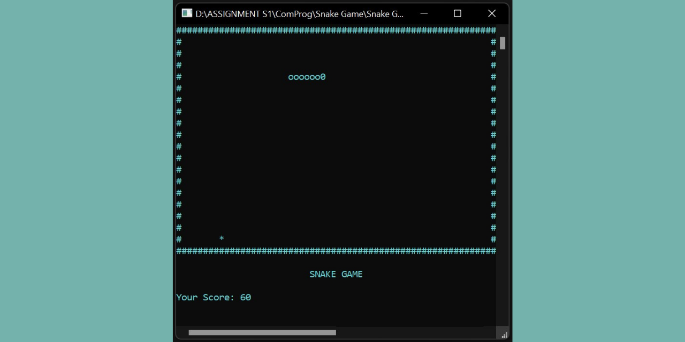

# Simple Snake Game Program using C# Programming Language
This is a final project of the Computing Career and Programming course. This project is a simple snake game program created using C# programming language where the user can play the game using a keyboard as a controller for the game which are 'arrow buttons' used to move the snake, 'S button' used to pause the game, 'R button' used to reset the game, and 'ESC button' used to quit the game. The rules are the same as the other snake game, if the snake eats the food, the user will gain +10 points and the snake tail will get longer and if the snake hit the wall, the snake directly died and the game is over.

